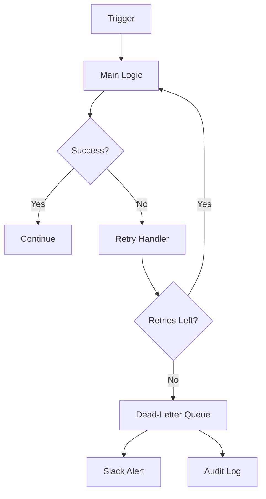

# n8n-error-handling-pattern

> Production-grade error handling patterns for n8n workflows — retry with exponential backoff, dead-letter queue, fallback paths, and audit logging. Importable sub-workflows, zero hardcoded credentials.

**Tested on:** n8n v1.x.x | **License:** MIT | **Status:** Active

---

## What It Does

This repo provides reusable error handling sub-workflows you can import into any n8n instance:

- **Retry with exponential backoff** — 3 retries with configurable delay multiplier
- **Dead-letter queue** — failed items logged to Airtable for manual review
- **Fallback path** — graceful degradation when a downstream service is unavailable
- **Audit logging** — PII-masked execution logs with timestamp and source tracking

## Architecture

## How to Import

1. Download any workflow JSON from the `workflows/` directory
2. In n8n: **Settings → Workflow Templates → Import from file**
3. Configure the credential placeholders listed in each workflow's README section
4. Set `active: true` only after testing with sample payloads from `payloads/`

## Workflows

| File | Pattern | Description |
|------|---------|-------------|
| *(coming in v0.2.0)* | — | — |

## Sample Payloads

See `payloads/` directory. Every workflow has a `success.json` and `failure.json` sample.

## Error Handling

Every workflow in this repo IS an error handling pattern. See `docs/architecture.md` for the full design rationale.

## Multi-Platform

| Platform | Coverage |
|----------|---------|
| n8n | Full workflow JSON (importable) |
| Make | `docs/make-equivalent.md` — conceptual rebuild guide |
| Zapier | `docs/zapier-equivalent.md` — conceptual rebuild guide |

## Business Impact

*(Coming in v0.2.0 — will include: time saved on debugging, silent failure reduction metrics)*

## Contributing

See [CONTRIBUTING.md](./CONTRIBUTING.md). All contributions require the pre-submit checklist.

## License

[MIT](./LICENSE) © 2024 Lorenz Espinosa
